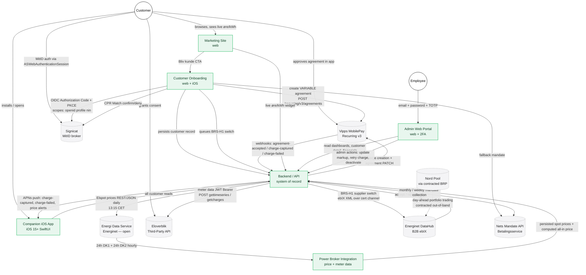

# Specification: System Overview

**Status:** Draft v1
**Owner:** Platform engineering / Product
**Last updated:** 2026-04-29

---

## 1. Overview

The Cheap Power Company (TCPC) is a Danish residential electricity brokerage
that resells power bought through a contracted Balance Responsible Party (BRP)
on Nord Pool, with a transparent per-kWh markup and a small recurring
subscription fee. The product is a usage-based, spot-indexed bill collected
via Vipps MobilePay Recurring (with Betalingsservice as a fallback channel)
and surfaced through a minimal SwiftUI iPhone app and a public marketing site.
Customer identity is established exclusively through MitID, brokered by
Signicat — there are no passwords. The company operates as a registered
Danish elleverandør, which requires DataHub registration with Energinet, a
DKK 1,000,000 cash deposit, digital certificates for the ebIX B2B channel,
and a Standard Agreement with each netselskab (DSO) where it has customers.
The commercial logic of the business depends on the 1 January 2026 reduction
of elafgift to ~1 øre/kWh, after which the spot price becomes the dominant
share of a residential electricity bill and a transparent broker model becomes
materially attractive to consumers.

This document specifies how the five internal components and seven external
systems fit together. Each component has its own detailed specification (see
section 6 — Specification Index). This overview owns only the boundaries,
data flows, and cross-cutting concerns between them.

---

## 2. System Components

| Component | Platform | Primary responsibility |
|---|---|---|
| Marketing Site | Web (responsive, SSR/static) | Convert anonymous visitors into the signup flow; show the live øre/kWh rate, pricing, and product story. Zero authentication, zero forms. |
| Customer Onboarding & Authentication | Web + iOS | Single end-to-end signup flow (MitID → CPR Match → address & metering point → MobilePay/Betalingsservice → BRS-H1 DataHub switch). Also handles returning-user MitID login. |
| Companion iOS App | iOS 15+ native (SwiftUI) | Day-to-day customer surface: current all-in price (øre/kWh), bill-so-far, hourly price curve, hourly consumption, MobilePay subscription management. |
| Admin Web Portal | Web (desktop-first) | Internal employee tool for operations, support, and finance. Email + password + TOTP 2FA. Dashboard, customer search, financials, pricing/markup edit, failed-payment retry. |
| Backend / API | Server | Central system of record. Owns the customer database, session store, pricing engine, billing scheduler, webhook ingestion, APNs push, and all credentialed calls to external systems. The app and portal call the backend; the backend calls the world. |
| Power Broker Integration | Server (logical sub-component of Backend) | Daily Elspot ingestion (DK1 + DK2), final consumer-price calculation (spot + margin + tariffs + elafgift + VAT), Eloverblik consent and meter-data pulls, and the regulatory artefact tracker (DataHub registration, deposit, certificates, BRP/netselskab agreements). |
| External — Energi Data Service (Energinet) | REST/JSON, open | Day-ahead Elspot prices for DK1 and DK2 (`Elspotprices` dataset). Free, unauthenticated, CC BY 4.0, ~12:45 CET daily publication. |
| External — Eloverblik (Energinet DataHub) | REST/JSON + JWT | Customer-consented hourly consumption (kWh) and per-metering-point charge breakdown via the third-party API. Refresh token (1 yr) → data access token (24 hr). |
| External — Energinet DataHub B2B | ebIX XML over certificate-authenticated channel | Mandatory hub for retail electricity transactions. BRS-H1 supplier-switch on customer signup; BRS-H3 wholesale settlement (out of scope for v1). Production and test certificates required. |
| External — Signicat (MitID broker) | OIDC (Authorization Code + PKCE) | Certified MitID broker. Authenticates customers (`openid profile nin`) and provides the CPR Match identity-verification add-on used during signup. Direct MitID integration is forbidden by law. |
| External — Vipps MobilePay Recurring API | REST/JSON v3 + webhooks | Primary recurring billing channel. Variable-amount agreements (`pricing.type=VARIABLE`), weekly or monthly intervals, agreement and charge webhooks consumed by the backend. |
| External — Nord Pool (via BRP) | Out-of-band (contracted BRP) | Physical day-ahead and intraday power trading on the customer's behalf. TCPC does not call Nord Pool directly; the BRP handles portfolio trading, balancing, and Engrosmodellen wholesale settlement. |
| External — Nets Mandate API (Betalingsservice) | REST/JSON | Fallback recurring billing channel for customers who decline or cannot complete MobilePay. CPR-keyed mandate against TCPC's PBS creditor number. |

---

## 3. System Architecture Diagram

**Notes on the diagram:**

- Solid arrows are runtime data flows owned by TCPC code; the dashed arrow
  to Nord Pool is an out-of-band commercial relationship handled by the
  contracted BRP, not a runtime call from our infrastructure.
- The Companion iOS App never calls MobilePay, Eloverblik, or Energi Data
  Service directly. The only external endpoint reached from the device is
  Signicat (and Eloverblik for consent) inside `ASWebAuthenticationSession`.
- The Power Broker Integration is shown as an internal component but is a
  logical part of the Backend / API; it is broken out because it owns the
  regulatory surface (DataHub, certificates, BRP, deposit) and the price
  computation.

---

## 4. Key Data Flows

### 4.1 Daily price ingestion (Energi Data Service → backend → app + marketing site)

A scheduled job in the Power Broker Integration runs at **13:15
Europe/Copenhagen** every day. It issues a single HTTP GET to
`https://api.energidataservice.dk/dataset/Elspotprices` filtered for `DK1`
and `DK2`, with `start = StartOfDay` and `end = StartOfDay + P2D`. The
response — 24 hourly records per area — is upserted into the local spot
price store keyed on `(hourUTC, priceArea)`. Once persisted, the backend
recomputes the all-in consumer price for each hour using
`(spot + supplier_margin + network_tariff + energinet_system_tariff +
energinet_balancing_tariff + elafgift) × 1.25`, with all components
date-versioned so the 1 January 2026 elafgift change does not retroactively
alter historical prices. The Companion iOS App reads tomorrow's prices via
`GET /v1/prices/tomorrow` and the current hour via `GET /v1/prices/current`;
the Marketing Site reads the live øre/kWh figure from the same internal
endpoint. CC BY 4.0 attribution to "Energi Data Service / Energinet" is
displayed wherever the data appears. If the latest persisted record is more
than 26 hours old, every consumer of the price API receives `stale: true`
and surfaces a "Live prices temporarily unavailable" notice.

### 4.2 Customer signup (marketing site → onboarding → MitID → MobilePay → DataHub H1 switch)

A visitor on the Marketing Site clicks the single "Bliv kunde" CTA and lands
on the Onboarding entry URL (or the iOS app via Universal Link if installed).
The flow runs:

1. Pre-flight screen explains the three steps.
2. **MitID** — OIDC Authorization Code + PKCE to Signicat with
   `scope=openid profile nin`. On iOS the request runs in
   `ASWebAuthenticationSession` with `idp_params` triggering the MitID
   app-switch. The backend validates the ID token against Signicat's JWKS
   and extracts `sub`, `mitid.uuid`, `given_name`, `family_name`,
   `birthdate`, and `nin`.
3. **CPR Match** — customer enters CPR; Signicat returns confirm/deny.
   Raw CPR is never persisted; only a salted hash is kept.
4. **Existing-customer detection** — lookup by `mitid.uuid`.
5. **Address, 18-digit metering point ID, billing frequency** (Ugentlig /
   Månedlig).
6. **Payment authorization** — primary path creates a
   `pricing.type=VARIABLE` agreement via
   `POST /recurring/v3/agreements`; the customer is deep-linked to
   `vippsConfirmationUrl` and approves in the MobilePay app. On rejection
   or 10-minute timeout the flow falls back to Betalingsservice via the
   Nets Mandate API.
7. **Confirmation screen** is shown immediately; a confirmation email is
   sent within 60 seconds.
8. **DataHub BRS-H1 supplier switch** is queued asynchronously: an
   ebIX-standard XML message is signed with the production certificate
   and submitted over the B2B channel. DataHub returns acceptance or
   rejection asynchronously; on acceptance the customer transitions from
   `PENDING` to `SCHEDULED` with a confirmed effective date (typically 6
   working days after submission).

### 4.3 Customer login and app usage (iOS → MitID → backend → Eloverblik → display)

A returning customer taps "Log ind med MitID" on the Companion App's Login
screen. AppAuth-iOS runs the same OIDC flow as signup (with `scope=openid
profile`), and the backend matches `mitid.uuid` to an existing customer.
The backend issues a TCPC session token (signed JWT) plus a refresh token,
both stored in the iOS Keychain with
`kSecAttrAccessibleAfterFirstUnlockThisDeviceOnly`. After login, the app
calls `GET /v1/prices/current`, `GET /v1/consumption?from=&to=`,
`GET /v1/subscription`, and `GET /v1/customer` to render Home, Consumption,
and Account. The backend in turn fetches consumption from Eloverblik
(`POST /api/meterdata/gettimeseries/{from}/{to}/Hour` with the customer's
24-hour data access token) and charges from
`POST /api/meterdata/getcharges`, refreshing the access token from the
1-year refresh token as needed. The app never sees Eloverblik tokens. If
Eloverblik consent has not yet been granted, Consumption shows the empty
state with a button that opens the Eloverblik consent flow inside
`ASWebAuthenticationSession`.

### 4.4 Monthly billing (backend scheduler → MobilePay Recurring charge → webhook confirmation)

For each active customer, on the customer's billing-period boundary (weekly
or monthly per their preference), the backend's billing scheduler
calculates the period's bill: hourly consumption (kWh) from Eloverblik
multiplied by the all-in øre/kWh for that hour, summed and converted to
DKK, plus the configured subscription fee. The backend creates a charge on
the customer's MobilePay agreement via
`POST /recurring/v3/agreements/{id}/charges` (or, for Betalingsservice
customers, lodges the collection through Nets). MobilePay processes the
charge and emits webhooks: `recurring.charge-captured.v1` on success or
`recurring.charge-failed.v1` on failure. The backend reconciles the
webhook against its charge record, updates customer state, and pushes an
APNs notification — "Betaling gennemført" on success or "Betaling
mislykkedes" on failure. The Companion App's Home screen surfaces a
non-dismissable banner on failure until the next charge succeeds; the
Admin Portal's Failed Payments queue shows the same event for support
follow-up.

### 4.5 Employee oversight (admin portal → backend → all data sources)

Employees authenticate to the Admin Web Portal with email + password +
TOTP 2FA — never MitID. Sessions expire after 8 hours of inactivity with
a hard cap of 24 hours. The dashboard renders four KPI cards (Active
Customers, MRR, Total Margin Month-to-Date, current DK1 / DK2 spot price)
backed by aggregate queries against the same backend database that serves
the app. Customer search, Customer Detail, Financials, and the failed-
payments queue all call backend endpoints which read from the customer
store, the spot price store, the Eloverblik consumption cache, and the
MobilePay charge log. Privileged admin actions — update markup, deactivate
customer, retry failed charge — write to an immutable audit log
(`timestamp`, `employeeId`, `action`, `targetType`, `targetId`, `before`,
`after`, `reason`) retained for 5 years. Role checks (`admin` vs
`read_only`) are enforced server-side; UI hiding alone is not sufficient.

---

## 5. Cross-Cutting Concerns

- **Authentication strategy.** Customers authenticate exclusively with
  MitID via Signicat (OIDC Authorization Code + PKCE; `openid profile nin`
  at signup, `openid profile` on subsequent logins). There are no
  passwords, no SMS OTP fallback, and `WKWebView` is forbidden for any
  MitID step. Employees authenticate with email + password + mandatory
  TOTP 2FA against a separate IdP — MitID is never used for staff. iOS
  refresh tokens live in Keychain
  (`kSecAttrAccessibleAfterFirstUnlockThisDeviceOnly`); web sessions use
  HttpOnly + Secure + SameSite=Lax cookies referencing server-side
  records.

- **Payment architecture.** Vipps MobilePay Recurring API v3 with
  `pricing.type=VARIABLE` is the primary channel — required because the
  bill fluctuates with hourly consumption. Betalingsservice via the Nets
  Mandate API is the contracted fallback for customers without MobilePay
  or whose MobilePay flow rejects/times out. Card payments are out of
  scope. Webhook events are the source of truth for charge state; the app
  never polls billing status.

- **Data residency & jurisdiction.** All TCPC services and data stores
  operate under Danish jurisdiction (assumed; see Open Question 5). All
  customer-facing currency is DKK; spot prices are displayed in øre/kWh.
  All scheduling and customer-facing display use Europe/Copenhagen; UTC
  is used for internal storage timestamps.

- **Regulatory compliance.** TCPC must be a registered elleverandør in
  DataHub before onboarding any production customer. Required artefacts:
  DataHub registration with Energinet; DKK 1,000,000 cash deposit
  (returned 6 months after deregistration); test and production digital
  certificates; an active BRP agreement; a Standard Agreement with each
  netselskab where customers exist; and ongoing master-data submission.
  The Power Broker Integration tracks each artefact's status and alerts
  ≥30 days before any certificate expiry. CC BY 4.0 attribution to
  "Energi Data Service / Energinet" is shown wherever spot data appears.
  Forsyningstilsynet (DUR) consumer-protection rules apply continuously.

- **GDPR & CPR handling.** CPR is processed under "performance of a
  contract" (Art. 6(1)(b)), pending final legal review. Raw CPR is sent
  only to Signicat (CPR Match) and Nets (Betalingsservice mandate); TCPC
  stores only a salted hash for duplicate detection. CPR is never logged,
  never sent to analytics, and never displayed back to the customer.
  Encryption: AES-256 at rest with KMS-managed keys; TLS 1.2+ in transit.
  Audit logs retained 7 years per Danish bookkeeping rules; employee
  audit logs retained ≥5 years.

- **Elafgift 2026 impact.** From 1 January 2026 elafgift drops from
  ~90 øre/kWh to ~1 øre/kWh, making the spot price the dominant share of
  the residential bill. All tariff and tax inputs are date-versioned so
  prices computed for hours before the cutover remain unchanged. Pricing
  models, marketing copy, FAQ content, and forecasting must be reviewed
  for both the pre- and post-2026 regimes. The product's commercial
  viability rests on this policy shift.

---

## 6. Specification Index

| Spec | File | Description |
|---|---|---|
| Marketing Site | [./marketing-site.md](./marketing-site.md) | Public read-only web entry point; live øre/kWh widget; single CTA into Onboarding. Danish only. |
| Customer Onboarding & Authentication | [./customer-onboarding.md](./customer-onboarding.md) | End-to-end signup (MitID → CPR Match → MobilePay/Betalingsservice → BRS-H1) and password-free returning login. |
| Companion iOS App | [./companion-app.md](./companion-app.md) | iPhone-only SwiftUI app: current price, bill so far, hourly curves, hourly consumption, MobilePay management. |
| Admin Web Portal | [./admin-portal.md](./admin-portal.md) | Internal employee tool: dashboard, customer search, financials, pricing edits, failed-payment queue. 2FA mandatory. |
| Power Broker Integration | [./power-broker-integration.md](./power-broker-integration.md) | Daily Elspot ingestion, all-in price calculation, Eloverblik consent + meter data, regulatory artefact tracking. |

---

## 7. Open Questions Consolidated

These are the cross-cutting questions whose answers affect more than one
component, drawn from the open-question lists of every component spec.
Component-local questions (e.g., individual default values, copy decisions,
single-screen UX) are kept in their respective specs.

1. **DataHub readiness gate (regulatory).** No production customer can be
   onboarded until DataHub registration, the DKK 1,000,000 deposit, the
   production certificate, the BRP contract, and at least one netselskab
   Standard Agreement are all in place. The DKK 1,000,000 figure is from
   the 2021 Terms of Access PDF and must be re-confirmed in writing with
   Energinet. Owner: Founders / Finance + Regulatory PM. Default
   assumption: budget DKK 1,000,000 and assume 6–12 weeks of regulatory
   onboarding before launch.

2. **DataHub B2B vs Eloverblik third-party API for own-customer meter
   data.** Once registered as a supplier, can TCPC pull its own
   customers' meter data directly via DataHub B2B (bypassing Eloverblik
   third-party consent)? This affects onboarding UX (skip the Eloverblik
   consent screen?), the backend's meter-data ingestion design, and the
   Admin Portal's data-freshness expectations. Owner: Platform engineering
   + Energinet liaison. Default assumption: Eloverblik third-party API
   with explicit consent in v1.

3. **DataHub modernisation (Green Energy Hub).** Energinet is migrating
   DataHub to an open-source platform on GitHub. The current ebIX B2B
   channel may be deprecated mid-roadmap. Owner: Platform engineering
   lead. Default assumption: build against the current channel and
   revisit before any second-year contract renewal.

4. **CPR storage GDPR legal review.** Final sign-off on the salted-hash
   posture (raw CPR sent only to Signicat and Nets, never persisted) is
   required before launch and affects Onboarding, Backend, and audit-log
   design. Owner: External counsel + DPO. Default assumption: salted hash
   only, Art. 6(1)(b) basis.

5. **Data residency and hosting jurisdiction.** Where TCPC infrastructure
   physically runs (Denmark, EU-only, or wider) is not yet decided and
   affects GDPR posture, customer trust messaging, and procurement of
   hosting/KMS providers. Owner: Founders + Engineering. Default
   assumption: EU-region hosting with Danish-jurisdiction data
   processing agreements.

6. **Signicat broker pricing and contract.** Per-authentication broker
   fees plus the 0.28 DKK MitID state fee are the dominant per-customer
   variable cost on the auth path. Affects Onboarding throttling
   strategy, Companion App refresh-token reuse policy, and unit
   economics shown in the Admin Portal's Financials. Owner: Commercial /
   CEO. Default assumption: 0.50–2.00 DKK per authentication plus a low
   monthly platform fee, until contract is signed.

7. **`suggestMaxAmount` ceiling on MobilePay agreements.** The backend
   passes a single ceiling at signup; this determines how many winter
   bills will silently exceed the customer's MobilePay max and trigger
   `charge-failed`. Affects Onboarding, the Companion App's troubleshoot
   view, and the Admin Portal's failed-payment queue. Owner: Product +
   Finance. Default assumption: 3,000 DKK at signup; revise after first
   winter.

8. **Eloverblik consent UX.** Whether Signicat's MitID session can be
   re-used for the Eloverblik consent grant, or whether the customer must
   authenticate again at eloverblik.dk, affects both the Onboarding spec
   and the Companion App's Consumption empty state. Owner: Backend lead.
   Default assumption: separate Eloverblik authentication inside
   `ASWebAuthenticationSession`.

9. **Netselskab tariff variability and ingestion.** Network tariffs
   differ per DSO, vary by time-of-use, and change annually. Affects the
   Power Broker Integration's price calculation, the Companion App's
   cost-breakdown display, and the Admin Portal's per-customer margin
   reporting. Owner: Data engineering. Default assumption: manually
   configured per supported DSO area in v1; build a scheduled tariff
   sync in v2.

10. **Elafgift 1 January 2026 cutover communications.** All four
    customer-facing surfaces (Marketing Site, Onboarding, App, email)
    plus internal forecasting depend on this. Whether to keep the
    elafgift line item visible at all post-2026 (~1 øre/kWh adds noise
    without information) is a product decision. Owner: Product +
    Marketing. Default assumption: keep visible for transparency;
    date-versioned tariff config drives all displays.

11. **Business / CVR customers and multi-metering-point households.**
    Both are out of scope for v1 across every component spec. Confirming
    the v2 timing affects roadmap commitments and what the Onboarding
    flow needs to leave room for. Owner: Product. Default assumption:
    v2 includes both (MitID Erhverv + multi-MP).

12. **English-language UI.** Every customer-facing component is Danish-
    only in v1 with localisation infrastructure in place. Affects when
    the company can serve non-Danish-speaking residents. Owner: Product.
    Default assumption: English ships in v2 alongside business-customer
    support.

13. **Webhook delivery reliability.** Charge state in the Companion App
    and the Admin Portal lags actual MobilePay state if webhooks are
    delayed or lost. The Admin Portal has a "Refresh from MobilePay"
    fallback; the App relies on webhook-driven APNs pushes. A backend
    reconciliation job spec is implied but not yet written. Owner:
    Platform engineering. Default assumption: implement a daily
    reconciliation pull against MobilePay agreements + charges and a
    Sentry-style alert when no webhook is received in 1 hour.

14. **Push-notification copy and price-alert thresholds.** The drafts in
    the Companion App spec need marketing-copy review and may interact
    with Marketing Site brand voice. Owner: Marketing/Copy. Default
    assumption: ship with the drafted Danish strings.
